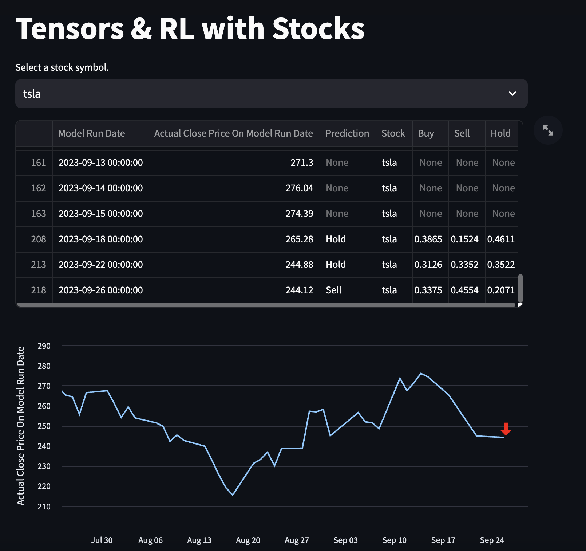

# Stocks Model

### Contents 
This repository sets up a template to sync yahoo finance data in to a postgres database with a moving window.  

### Methodology
Using a decomposition based on parafac, the time relevant scores are then used within a basic reinforcement (A2C) model borrowed from keras examples is used to simulate different trading options to train an agent. The results can be visualized via a basic streamlit application.

### Local Database. 
This assumes a local postgres database has been set up and accessible via port 5432 and running with the database name stockcurrency. See ```__init__.py``` file has the excerpt ```postgresql://localhost/stockcurrency```.

### Setting up the environment
The package management is done by poetry. 
```
conda create -n stocks
conda activate stocks
conda install pip
pip install poetry
poetry install
python prediction_template.py # Change and add historical data you want per symbol.
python run.py
```
### Details
The data is pulled in ```dbupdate.py``` from August 2018 to change that review the line:
```
def database(all_symbols, session, basetime=datetime(2019, 8, 22))
```
The file ```max_reward_models.json``` is the latest and best reward found for that particular stock model.

### Output and viewing the results
The final model will be output with ```SYMBOL.keras``` and ```SYMBOL.results``` files respectively. The keras file is the model and the results file is the actual predictions the agent did. Finally, a ```predictions.csv``` is output, just remember an initial ```predictions.csv``` file either empty through the ```prediction_template.py``` or with historical data per stock symbol needs to be added since the script pulls that in at the start to then append new daily results to it. The predictions format is as follows:
```
,Model Run Date,Actual Close Price On Model Run Date,Prediction,Stock,Buy,Sell,Hold
0,YYYY-MM-DD,PRICE,,SYMBOL,,,
```
The ```predictions.csv``` can be visualized using a streamlit app where the green arrows indicate a buy signal and red arrows indicate a sell symbol. 



### Future
- More free data features to the model (i.e., economic data, available balance statements). So far I am using free yahoo finance data.
- Validation metrics on model performance.
- Orchestration for automatic refresh (i.e., airflow).

### Contact 
If you would like to collaborate or need any help with the code you can reach me at satesh.ramdhani@gmail.com. 